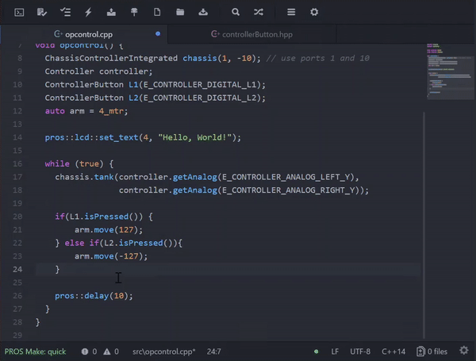

=================
Announcing PROS 3
=================

.. post:: 27 Apr, 2018
   :tags: blog
   :excerpt: 1

Today, we're excited to share with you the next iteration of PROS, the open
source development environment for VEX EDR. With PROS 3, you will be able to
program the VEX EDR Cortex and the VEX V5 from a single development environment.

PROS is a free development environment created by students at Purdue University
as an advanced platform to take advantage of the robot microprocessor. Originally
developed in 2012 for Purdue's VEX U team BLRS, PROS was open sourced and made
available to the larger VEX community in 2013. Since then, PROS has continued to
grow to become a key programming environment for students around the world.
Through PROS's standardized, flexible toolset, students are exposed to and get
excited about using real-world development tools seen in the industry.

PROS is primarily comprised of three components: the PROS Kernel, which runs on a
robot's microcontroller; the PROS Command Line Interface, which enables project
creation and compiles and uploads PROS projects; and the PROS Editor, which is
an editor supporting all of the features of PROS based on `Atom <https://atom.io>`_.

Features for PROS include:

* Develop in Windows, Linux, or macOS
* User-friendly Atom-based editor
* A real-time operating system built on FreeRTOS to take advantage of all of the
  capabilities of the robot microcontroller
* Use of industry-standard libraries and languages, including standard C/C++
  libraries (newlib/libstdc++), C11, and C++17
* Use of industry-standard tools, including GNU Make and GCC

The new version of the PROS Kernel will support the V5. PROS 3 Kernel
is purpose-built to take advantage of the new features of the V5. Beyond having
complete control over V5 Smart Devices in the C language, the PROS 3 Kernel
provides object-oriented abstractions in C++ and offers best-in-class
extensibility to enable users to maximize the capabilities of their V5 robot.
The current Cortex will continue to be supported in the PROS 3 environment with
the PROS 2.x Kernel and the existing features it provides via its
`C language API <../../cortex/api/index.html>`_

The improved PROS Editor is the officially supported integrated development environment.
Built as a plugin to the Atom Editor, the PROS Editor brings all of the
flexibility of Atom to VEX Robotics programmers. It features completely custom
theming, syntax highlighting, code linting, context-aware code completion,
and, of course, the ability to create, build, and upload PROS projects.

If PROS Editor isn't your cup of tea, the PROS Command Line Interface (CLI)
enables users to perform every task related to programming with PROS. In fact,
the PROS Editor uses the PROS CLI behind the scenes. This enables users to use any
editor of their choice, such as Visual Studio Code, Eclipse, and others. One
great new feature of the CLI is that you can share libraries with other PROS
users around the world or within your team/organization.

To showcase this, we would like to spotlight the OkapiLib library, developed by
Ryan Benasutti at WPI. OkapiLib is an easy to use library of common
functionality used by successful teams in VRC and VEX U. Some features include
simple closed-loop chassis control, powerful filtering facilities, and many
quality of life improvements.

.. tabs ::
  .. tab :: C++
    .. highlight:: cpp
    .. code-block:: cpp

       using namespace okapi;

       void opcontrol() {
         ChassisControllerIntegrated chassis({19, 20},           // Left motors in ports 19 and 20
                                             {-13, -14},         // Right motors (reversed by "-") in ports 13 and 14
                                             pros::gearset::red, // Using the 100 RPM standard red gearset
                                             {4_in, 11.5_in});   // Physical parameters of robot for autonomous control

         // Sample autonomous movements you can do
         chassis.moveDistance(3.25_ft); // Drive the robot 3.25 feet forward
         chassis.turnAngle(45_deg);     // Turn the robot 45 degrees clockwise

         pros::lcd::set_text(4, "Hello, World!"); // Use the PROS LCD Emulator of the VEX EDR LCD Screen

         Controller controller;  // Create a controller object representing the main controller
         pros::Vision vision(1); // Create a vision sensor connected to port 1

         while (true) {
           // Tank drive with left and right sticks
           chassis.tank(controller.getAnalog(CONTROLLER_ANALOG_LEFT_Y),
                        controller.getAnalog(CONTROLLER_ANALOG_RIGHT_Y));

           pros::lcd::print(5, "There are %d objects visible", vision.get_object_count());

           // Wait and give up the time we don't need to other tasks.
           pros::delay(10);
         }
       }

`OkapiLib <../okapi/index.html>`_ is an optional library installed by default in
all PROS for V5 projects since we believe it provides easy and efficient
abstractions that help users program advanced robot functionality.

PROS 3 is currently available to V5 Beta Testers and will be released when the V5
begins shipping. Today, you can find our documentation (on this `site <../index.html>`_) to learn
more about PROS 3. We look forward to sharing more details about PROS 3 and the
capabilities of the new V5 system in the coming weeks and months. Check back here
or on the VEX Forum to get more information.
